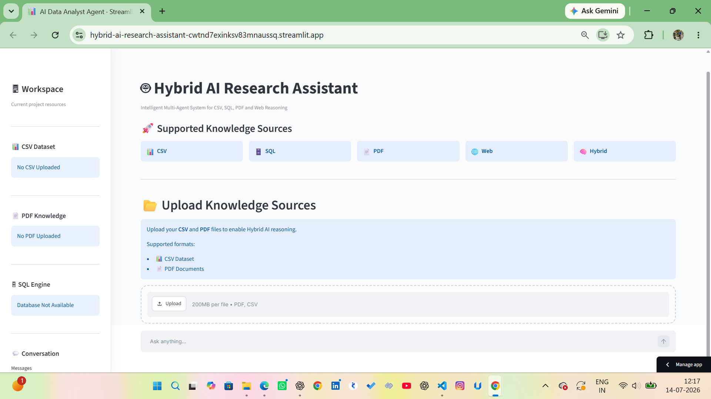
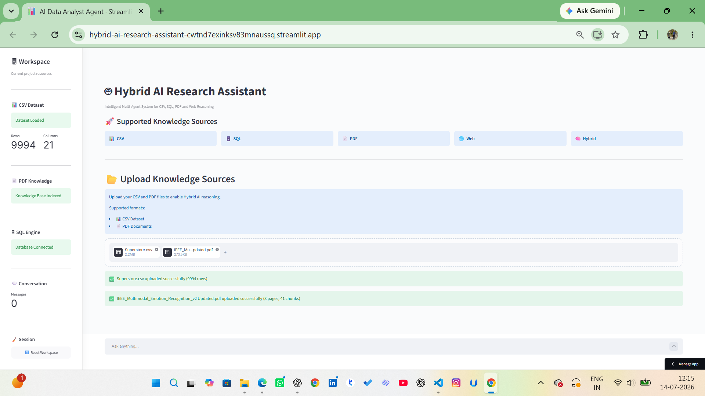
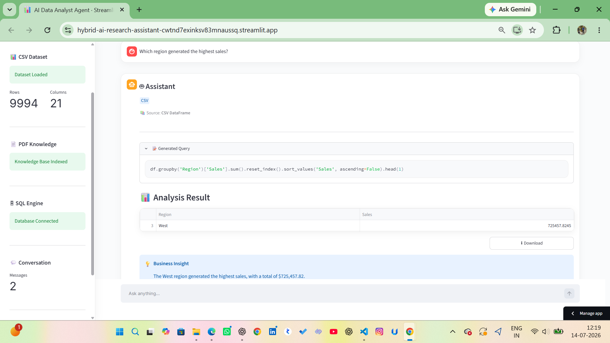
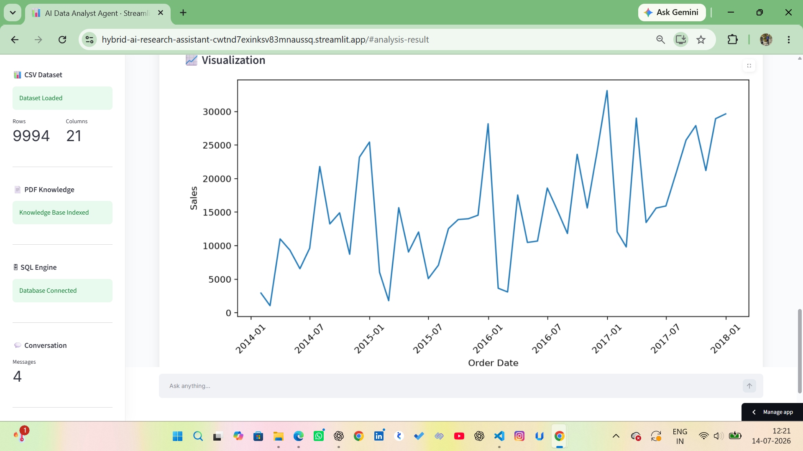
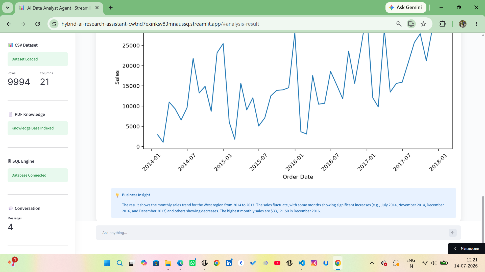
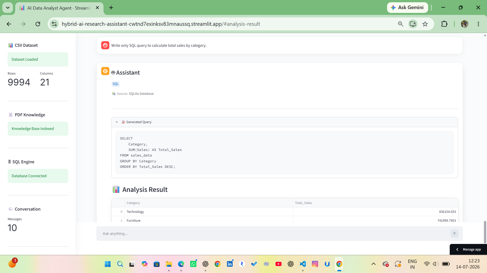
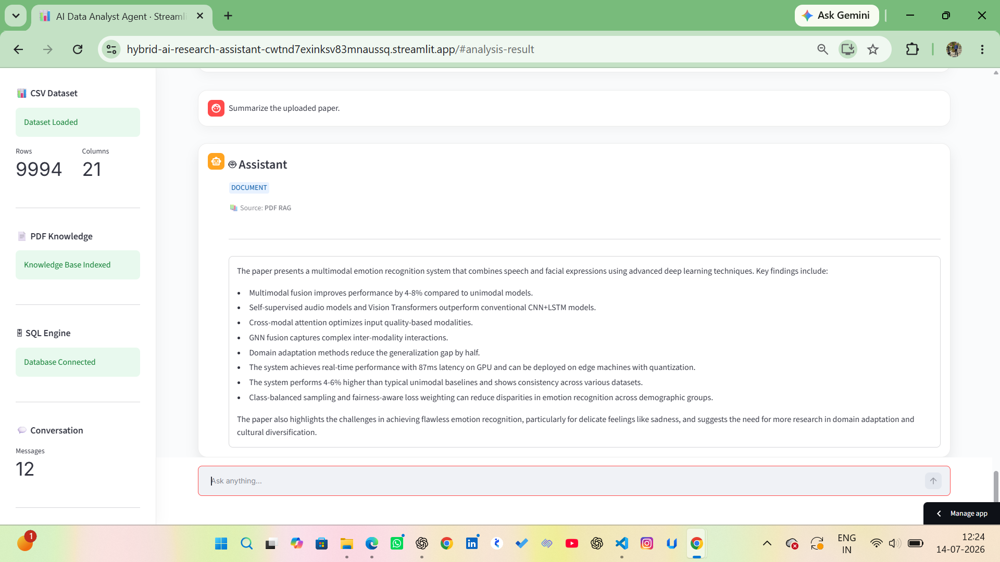
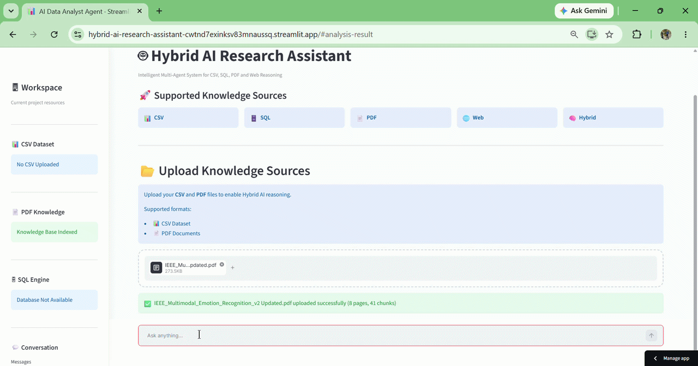
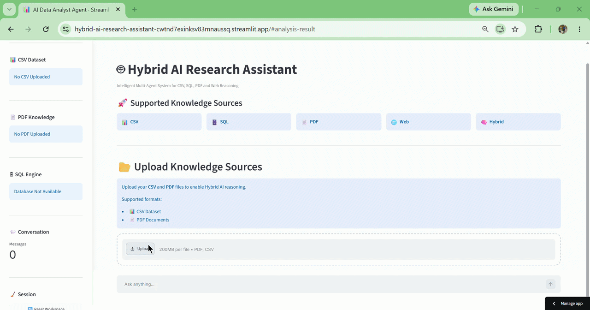

# 🚀 Hybrid AI Research Assistant

An intelligent multi-source AI assistant that can reason over **CSV datasets**, **PDF documents**, **SQL databases**, and the **Web** through a single conversational interface.

Unlike traditional chatbots that work with only one data source, this assistant automatically routes user queries to the appropriate knowledge source and combines multiple sources when required to provide accurate, context-aware responses.

---

## 🌐 Live Demo

**🔗 Streamlit App:**  
https://hybrid-ai-research-assistant-cwtnd7exinksv83mnaussq.streamlit.app/

---

# ✨ Features

## 📊 CSV Analytics
- Natural language data analysis
- Automatic Pandas query generation
- Business insights generated by Gemini
- Interactive visualizations
- Downloadable results

---

## 📄 PDF Question Answering
- RAG (Retrieval-Augmented Generation)
- Semantic search using FAISS
- Gemini Embeddings
- Context-aware document understanding
- Supports multiple PDF uploads

---

## 🗄 SQL Database Querying
- Converts natural language into SQL
- Executes queries automatically
- Displays structured results
- Useful for database exploration

---

## 🌍 Web Search
- Real-time internet search
- Wikipedia integration
- DuckDuckGo search
- Latest information retrieval

---

## 🧠 Hybrid Multi-Agent Routing

The assistant intelligently decides which source(s) should answer the question.

Examples:

- "Show monthly sales trend."
→ CSV Agent

- "Summarize this research paper."
→ PDF RAG Agent

- "Write an SQL query for total sales by category."
→ SQL Agent

- "What is Retrieval-Augmented Generation?"
→ Web Agent

- "Compare my uploaded research paper with recent web information."
→ Hybrid Agent

---

# 🏗 Architecture

```text
                     User Question
                           │
                           ▼
                 Intelligent Router
                           │
      ┌──────────────┬──────────────┬─────────────┐
      ▼              ▼              ▼             ▼
   CSV Agent      PDF RAG       SQL Agent     Web Agent
      │              │              │             │
      └──────────────┴──────────────┴─────────────┘
                           │
                           ▼
                     LLM Response
```

---

# 🛠 Tech Stack

## LLM

- llama-3.3-70b-versatile

## AI Framework

- LangChain
- LangChain Community

## Retrieval

- Gemini Embeddings
- FAISS Vector Database
- Recursive Text Splitter

## Data Analysis

- Pandas
- NumPy

## Visualization

- Matplotlib

## Database

- SQLite
- SQLAlchemy

## Document Processing

- PyPDF

## Web Search

- DuckDuckGo
- Wikipedia

## Frontend

- Streamlit

---

# 📸 Application Preview

## Home Page

<p align="center">

</p>

## Upload CSV & PDF

<p align="center">

</p>

## CSV Analysis

<p align="center">

</p>


## Interactive Visualization

<p align="center">

</p>

## Business Insights

<p align="center">

</p>

## SQL Query Generation

<p align="center">

</p>

## PDF Question Answering

<p align="center">

</p>

# 🎥 Demo Videos

## Workflow

Upload PDF → PDF → Hybrid Questions

<p align="center">

</p>

## Visualization Demo

Natural Language → Automatic Chart → Business Insight

<p align="center">

</p>

# ⚡ Installation

Clone the repository

```bash
git clone https://github.com/jayantdeshwal/Hybrid-AI-Research-Assistant.git
```

Navigate to project

```bash
cd Hybrid-AI-Research-Assistant
```

Install dependencies

```bash
pip install -r requirements.txt
```

Create a `.streamlit/secrets.toml`

```toml
GEMINI_API_KEY="YOUR_API_KEY"
GROQ_API_KEY="YOUR_API_KEY"
```

Run

```bash
streamlit run app.py
```

---

# 📂 Project Structure

```text
Hybrid-AI-Research-Assistant
│
├── app.py
├── agents/
├── prompts/
├── rag/
├── sql/
├── ui/
├── utils/
├── requirements.txt
└── README.md
```

---

# 🎯 Key Highlights

✅ Multi-Agent Architecture

✅ Retrieval-Augmented Generation (RAG)

✅ Gemini Embeddings

✅ FAISS Semantic Search

✅ Natural Language → SQL

✅ Natural Language → Pandas

✅ Interactive Data Visualizations

✅ Business Insight Generation

✅ Hybrid Knowledge Source Routing

✅ Production-ready Streamlit UI

---

# 📈 Future Improvements

- Conversation Memory
- Authentication
- Chat History
- Multiple Vector Stores
- Cloud Database Support
- Streaming Responses
- Agent Monitoring Dashboard
- Export Chat History

---

# 👨‍💻 Author

**Jayant Deshwal**

AI Engineer | Generative AI | Machine Learning | LangChain | RAG | AI Agents

LinkedIn: www.linkedin.com/in/jayant-deshwal

GitHub: https://github.com/jayantdeshwal

---

## ⭐ If you found this project useful, consider giving it a star!